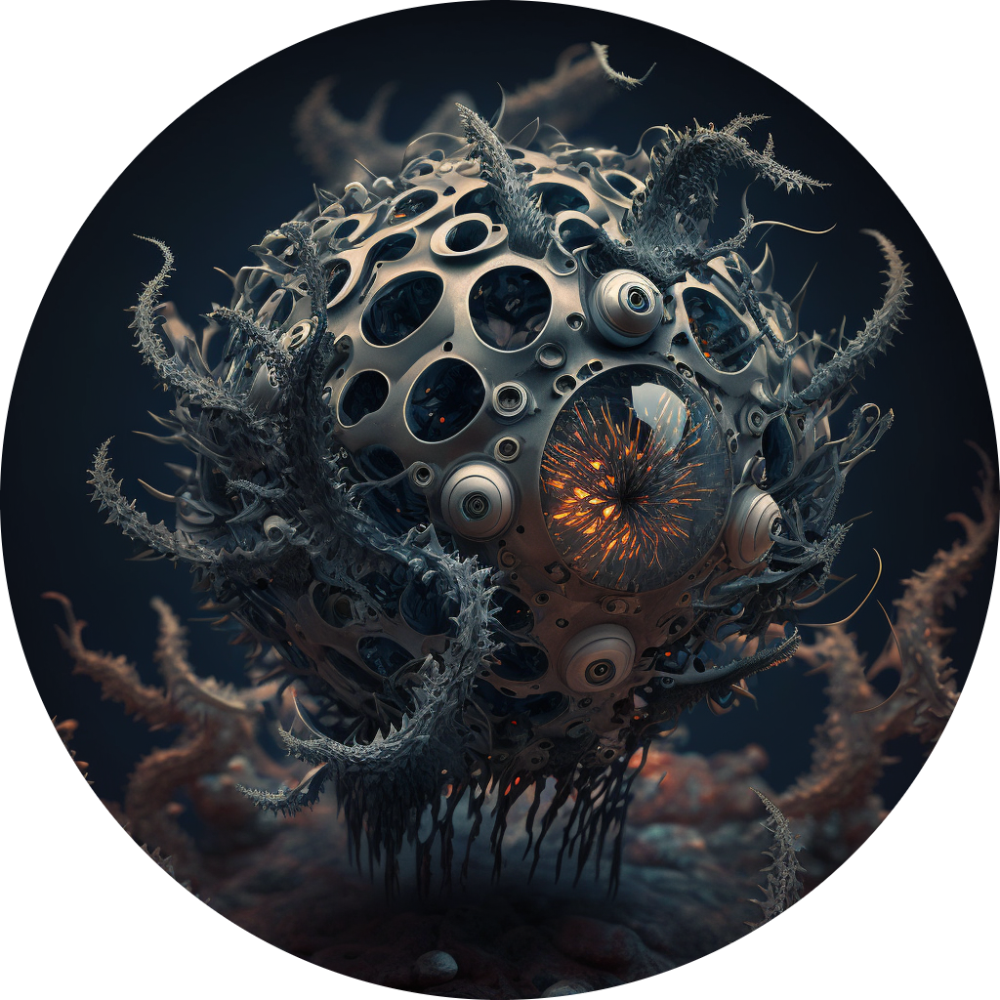

<p align="center">

</p>

# Steginator


This repo contains the code and configuration files necessary to use `Steginator`, a high-throughput morphometrics pipeline for _Steginoporella magnifica_ specimens. It is based on a combination of [DeepBryo](https://github.com/agporto/DeepBryo/) and [ml-morph](https://github.com/agporto/ml-morph)


## Updates
03/2023  - `Steginator` is first available


## Installation

**Note:** As of now, macOS is not supported by `Steginator` due to lack of CUDA support. 


Below are quick steps for installation using [Anaconda](https://www.anaconda.com/) or [Miniconda](https://docs.conda.io/en/latest/miniconda.html) in `Linux` or `Windows` (assuming the presence of an `NVIDIA` gpu):

```
conda create -n steginator python=3.7 pytorch=1.10 cudatoolkit=11.3 torchvision==0.11 -c pytorch -y
conda activate steginator
pip3 install openmim
mim install mmcv-full==1.4.0
git clone https://github.com/agporto/Steginator.git
cd Steginator
pip3 install -e .
```

## Usage

You can use `Steginator` as a command line tool. Simply use the following command:

```
python steginator.py -i INPUT_DIR -o OUT_DIR [other optional arguments]
```

The parameters associated with the cli tool mirror the web app and are:

```
usage: steginator.py [-h] -i INPUT_DIR -o OUT_DIR [-c CLASS] [-p PADDING [PADDING ...]] [-t CONFIDENCE] [-s STRICTNESS]

optional arguments:
  -h, --help            show this help message and exit

  -i INPUT_DIR, --input_dir INPUT_DIR
                        folder containing images to be predicted (required)

  -o OUT_DIR, --out-dir OUT_DIR
                        output folder (required)

  -c CLASS, --class CLASS
                        object class of interest. 
                        options: only autozooid is currently supported

  -p PADDING [PADDING ...], --padding PADDING [PADDING ...]
                        remove objects falling within a certain distance from
                        the image border. please provide it as a list in the
                        following order: left, top, right, bottom

  -t CONFIDENCE, --confidence CONFIDENCE
                        model's confidence threshold (default = 0.5)

  -s STRICTNESS, --strictness STRICTNESS
                        regulated the strictness of the automated filtering algorithm

  -sc SCALE, --scale SCALE
                        pixel-to-um scaling parameter (default = None)
```


## Citing Steginator

Please cite the following papers if you use `Steginator` in your research:
```
@article {Di Martino2022.11.17.516938,
	author = {Di Martino, Emanuela and Berning, Bjorn and Gordon, Dennis P. and Kuklinski, Piotr and Liow, Lee Hsiang and Ramsfjell, Mali H. and Ribeiro, Henrique L. and Smith, Abigail M. and Taylor, Paul D. and Voje, Kjetil L. and Waeschenbach, Andrea and Porto, Arthur},
	title = {DeepBryo: a web app for AI-assisted morphometric characterization of cheilostome bryozoans},
	year = {2022},
	doi = {10.1101/2022.11.17.516938},
	publisher = {Cold Spring Harbor Laboratory},
	URL = {https://www.biorxiv.org/content/early/2022/11/17/2022.11.17.516938},
	eprint = {https://www.biorxiv.org/content/early/2022/11/17/2022.11.17.516938.full.pdf},
	journal = {bioRxiv}
}

@article{https://doi.org/10.1111/2041-210X.13373,
author = {Porto, Arthur and Voje, Kjetil L.},
title = {ML-morph: A fast, accurate and general approach for automated detection and landmarking of biological structures in images},
journal = {Methods in Ecology and Evolution},
volume = {11},
number = {4},
pages = {500-512},
keywords = {automation, biological structures, dense phenotyping, landmarks, machine learning, morphometrics, phenotyping pipeline, zooids},
doi = {https://doi.org/10.1111/2041-210X.13373},
url = {https://besjournals.onlinelibrary.wiley.com/doi/abs/10.1111/2041-210X.13373},
eprint = {https://besjournals.onlinelibrary.wiley.com/doi/pdf/10.1111/2041-210X.13373},
year = {2020}
}

```


